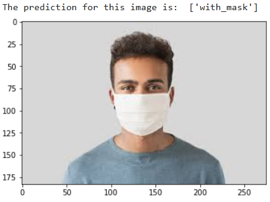

# No-Face Mask Detection using Deep Learning

A Deep Learning project used to automatically classify whether a person is wearing a mask or not.

---

## Overview

During the COVID-19 pandemic, enforcing mask compliance in public areas became essential.  
This project implements an automated deep learning pipeline that:

- Classifies each detected face into:
  -  **Mask**
  -  **No Mask**

---

## Tech Stack

- Python  
- TensorFlow / Keras  
- OpenCV  
- Scikit-learn  
- Haar Cascade  
- Transfer Learning  

---

## Results

| Model | Accuracy |
|--------|----------|
| DenseNet121 + RF | **99.5%** |
| VGG16 + RF | 99.1% |

DenseNet121 achieved the best performance.

---

## Sample Output

---

## Key Highlights

- Achieved **99%+ accuracy** using transfer learning
- Synthetic dataset generation for robustness
- Real-time capable detection pipeline

---

